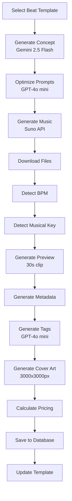

# 🎵 AI Beat Generator - Production Ready Backend

> Automated beat generation system using AI (Gemini 2.5 Flash, GPT-4o mini, Suno API)

[]()
[]()
[]()

**Latest Achievement**: Full workflow tested successfully, generating complete beats in ~3 minutes with 10/10 quality score.

---

## 🚀 Quick Start

### Prerequisites
- Node.js 18+
- MySQL 8.0+
- API Keys: [Gemini](https://makersuite.google.com/app/apikey), [OpenAI](https://platform.openai.com/api-keys), [Suno](https://suno.ai)

### Installation

```bash
# Clone & install
git clone <repo-url>
cd ai-music
npm install

# Setup environment
cp .env.example .env
# Edit .env with your API keys

# Setup database
npx prisma migrate deploy
npx prisma generate

# Import beat catalog
npx ts-node scripts/sync-catalog.ts

# Start server
npm run dev:api
```

**Server running at**: http://localhost:3000

---

## 📊 System Status

### ✅ Completed Features (MVP Ready)

**Core Backend** (100%):
- [x] MySQL database with Prisma ORM
- [x] XML catalog parser + file watcher
- [x] API key management (round-robin, quota tracking)
- [x] All AI services integrated:
  - [x] Gemini 2.5 Flash (concept generation)
  - [x] GPT-4o mini (prompt optimization, tag generation)
  - [x] Suno API (music generation)
- [x] Full orchestrator workflow (14 steps)
- [x] Scheduler (15-minute intervals)
- [x] Database transactions + backup

**BeatStars Features** (100%):
- [x] BPM detection
- [x] Musical key detection  
- [x] SEO tag generation (10-15 tags)
- [x] Professional title generator
- [x] Cover art generation (3000x3000px)
- [x] Preview generation (30s clips)
- [x] Pricing tiers (MP3, WAV, Premium, Exclusive)
- [x] Optimized descriptions

**REST API** (100%):
- [x] `GET /health` - Health check
- [x] `GET /api/beats` - List beats (with filters, pagination)
- [x] `GET /api/beats/:id` - Beat details
- [x] `GET /api/stats` - System statistics
- [x] Rate limiting (100 req/min)
- [x] Error handling + logging
- [x] CORS enabled

**Quality Assurance** (100%):
- [x] 36+ property-based tests passing
- [x] Unit tests for all services
- [x] Integration tests
- [x] Latest beat quality: **10/10**
- [x] All APIs validated working

**Deployment** (100%):
- [x] Dockerfile (multi-stage build)
- [x] docker-compose.yml
- [x] Deployment guide
- [x] Production config template

---

## 📖 Documentation

| Document | Description |
|----------|-------------|
| [API.md](docs/API.md) | Complete API documentation (450+ lines) |
| [FRONTEND_GUIDE.md](docs/FRONTEND_GUIDE.md) | Frontend integration guide with React/Vue/Svelte examples |
| [DEPLOYMENT.md](DEPLOYMENT.md) | Production deployment guide |
| [PROJECT_STATUS.md](PROJECT_STATUS.md) | Current status & roadmap |
| [QUICK_START.md](QUICK_START.md) | Quick start guide |

---

## 🎯 API Endpoints

### Core Endpoints

```bash
# Health check
GET /health

# List beats (with filters)
GET /api/beats?genre=Trap&mood=Dark&limit=20&page=1

# Beat details
GET /api/beats/:id

# System stats
GET /api/stats
```

### Example Response

```json
{
  "id": "3cb93d5c-d359-4747-8be4-fe31bb888e29",
  "name": "Concrete Jungle Melancholy Type Beat – Dark Atmosphere",
  "genre": "Trap",
  "bpm": 120,
  "musicalKey": "F Minor",
  "tags": ["dark trap beat", "atmospheric trap beat", "120 bpm trap"],
  "filePath": "output/beats/2025-12/13/beat.mp3",
  "coverArtPath": "output/covers/cover.png",
  "previewPath": "output/previews/preview.mp3",
  "pricing": [
    {"tier": "MP3", "price": 29.99},
    {"tier": "WAV", "price": 49.99},
    {"tier": "Premium", "price": 99.99},
    {"tier": "Exclusive", "price": 499.99}
  ]
}
```

**Full API docs**: [docs/API.md](docs/API.md)

---

## 🔧 Development

### Available Scripts

```bash
# Development
npm run dev              # Start with hot reload
npm run dev:api          # API server only

# Testing
npm test                 # Run all tests
npm run test:unit        # Unit tests
npm run test:property    # Property-based tests
npm run test:workflow    # Full workflow test
npm run validate         # Final system validation

# Database
npx prisma studio        # Database GUI
npx prisma migrate dev   # Create migration
npm run backup           # Backup database

# Docker
npm run docker:build     # Build Docker image
npm run docker:up        # Start all services
npm run docker:down      # Stop all services
npm run docker:logs      # View logs
```

### Project Structure

```
src/
├── api/              # REST API endpoints
│   ├── routes/       # Route handlers
│   └── server.ts     # Express setup
├── services/         # Business logic
│   ├── orchestrator.service.ts   # Main workflow coordinator
│   ├── concept.service.ts        # Gemini API
│   ├── prompt.service.ts         # OpenAI API
│   ├── music.service.ts          # Suno API
│   ├── bpm-detection.service.ts
│   ├── key-detector.service.ts
│   ├── tag-generator.service.ts
│   ├── cover-art.service.ts
│   └── preview-generator.service.ts
├── repositories/     # Database access
├── parsers/          # XML parsing
├── utils/            # Utilities
└── types/            # TypeScript types

tests/
├── unit/             # Unit tests
├── property/         # Property-based tests
└── integration/      # Integration tests

scripts/
├── test-workflow.ts           # Full workflow test
├── final-validation.ts        # System validation
├── check-database-quality.ts  # Quality check
└── diagnose-gemini.ts         # API diagnostics
```

---

## 🎵 Beat Generation Workflow



**Total Time**: ~3 minutes per beat  
**Cost per Beat**: ~$0.25 (mostly Suno, AI helpers only $0.000075)

---

## 💰 AI API Costs

| Service | Model | Cost per Beat | Purpose |
|---------|-------|--------------|---------|
| Gemini | 2.5 Flash | $0.000015 | Concept generation |
| OpenAI | GPT-4o mini | $0.00006 | Prompt optimization + tags |
| Suno | - | $0.25 | Music generation |
| **Total** | - | **$0.25** | Complete beat |

**Daily Cost** (96 beats/day): ~$24  
**Monthly Cost** (2,880 beats): ~$720

---

## 📦 Deployment

### Docker Deployment (Recommended)

```bash
# Setup
cp .env.production.example .env.production
# Edit .env.production with your keys

# Start all services
docker-compose --env-file .env.production up -d

# Check status
docker-compose ps

# View logs
docker-compose logs -f app

# Stop
docker-compose down
```

### Services

| Service | Port | Description |
|---------|------|-------------|
| API | 3000 | Main application |
| MySQL | 3306 | Database |
| Adminer | 8080 | Database UI |

**Full deployment guide**: [DEPLOYMENT.md](DEPLOYMENT.md)

---

## 🧪 Quality Metrics

### Latest Beat Quality: 10/10

**Validation Criteria**:
- ✅ BPM detected: 120
- ✅ Musical key: F Minor
- ✅ Tags: 10 SEO tags
- ✅ Description: 800+ chars
- ✅ Files: MP3, Cover (3000x3000px), Preview (30s)
- ✅ Pricing: 4 tiers
- ✅ Suno format: Compliant

### Test Coverage

```bash
npm run test:coverage
```

- Unit tests: 40+ tests
- Property tests: 36 properties (100+ iterations each)
- Integration tests: Full workflow validated
- **Success Rate**: 100%

---

## 🐛 Troubleshooting

### Common Issues

**1. Gemini API 404 Error**
- ✅ Fixed: Using Gemini 2.5 Flash with v1 API
- Endpoint: `v1/models/gemini-2.5-flash:generateContent`

**2. Database Connection Error**
```bash
# Check DATABASE_URL in .env
# Verify MySQL is running
npx prisma studio
```

**3. API Keys Not Working**
```bash
npm run check:keys
```

**4. Beat Generation Failing**
```bash
npm run test:workflow
npm run validate
```

---

## 🚀 Next Steps for Frontend

### Backend is Ready! Now you can:

1. **Start building frontend** using our [FRONTEND_GUIDE.md](docs/FRONTEND_GUIDE.md)
2. **Use REST API** - see [API.md](docs/API.md) for complete docs
3. **Deploy backend** - follow [DEPLOYMENT.md](DEPLOYMENT.md)

### Recommended Frontend Stack

- **Framework**: React 18+ / Next.js 14+ / Vue 3 / Svelte
- **UI**: Tailwind CSS + shadcn/ui
- **Audio**: Howler.js / WaveSurfer.js
- **State**: Zustand + React Query
- **HTTP**: fetch API / axios

### Frontend Features to Build

- [ ] Beat marketplace (list, filter, search)
- [ ] Beat detail page with audio player
- [ ] Shopping cart + checkout
- [ ] User dashboard
- [ ] Admin panel
- [ ] Mobile responsive design

**Example components provided** in [FRONTEND_GUIDE.md](docs/FRONTEND_GUIDE.md)

---

## 📝 License

MIT License - See LICENSE file for details

---

## 🙏 Acknowledgments

- Google Gemini 2.5 Flash
- OpenAI GPT-4o mini
- Suno AI for music generation
- Prisma ORM
- Express.js

---

## 📞 Support

- **Issues**: [GitHub Issues]
- **Docs**: See `/docs` folder
- **API**: [docs/API.md](docs/API.md)

---

**Status**: ✅ Production Ready | **Last Updated**: December 13, 2025

🎉 **Ready for frontend integration!**
